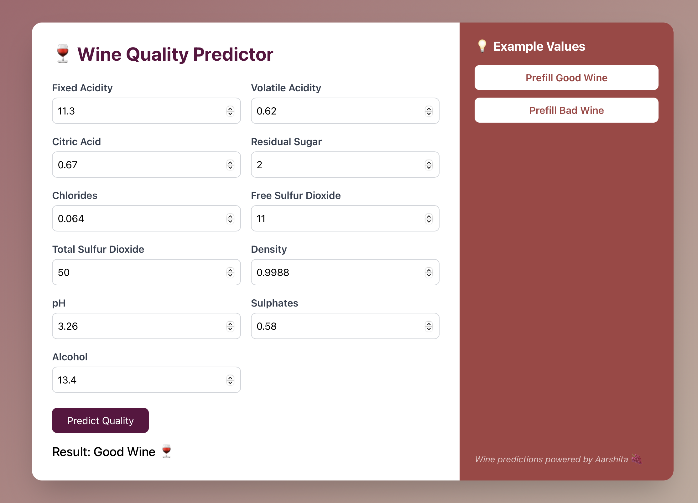

# 🍷 Wine Quality Classifier

A sleek, vineyard-inspired web app that predicts wine quality using machine learning classification models — with a focus on **Random Forest Classifier**.

Simply enter values like acidity, alcohol, and sugar content — and get a result: **Good Wine** or **Bad Wine**.


Built using **React**, **Flask**, and **scikit-learn**.

## 📊 Dataset

I’ve used the [UCI Wine Quality Dataset](https://archive.ics.uci.edu/ml/datasets/wine+quality) (red wine version), which includes real-world features like:

- Fixed Acidity  
- Volatile Acidity  
- Citric Acid  
- Residual Sugar  
- Chlorides  
- Free Sulfur Dioxide  
- Total Sulfur Dioxide  
- Density  
- pH  
- Sulphates  
- Alcohol  

## 🎯 Goal

Train a **Random Forest Classifier** to categorize wine as:

- **Good Wine** (quality ≥ 6)  
- **Bad Wine** (quality < 6)  

The model is trained using `scikit-learn` and deployed with `Flask`.

## ⚙️ How It Works

### Machine Learning (scikit-learn)
- The model is trained on wine features and labels using a **Random Forest Classifier**
- Feature preprocessing and training done in `train.py`
- Model is saved using `joblib`.

### Backend (Flask)
- `app.py` exposes a `/predict` endpoint for POST requests
- Loads the trained model and returns prediction based on user input.

### Frontend (React + Tailwind CSS)
- Responsive form to enter wine attributes
- “Prefill” buttons for good/bad wine examples
- Beautifully styled with warm gradient backgrounds and smooth transitions.

## 📸 Screenshots

### Input Form
Users can enter 11 wine-related parameters or prefill sample values.

### Prediction Result
The result is displayed as:
- **Good Wine 🍷** or  
- **Bad Wine 🙁** based on the model output.



## 🚀 Getting Started

### Backend

```bash
cd backend
pip install -r requirements.txt
python app.py
```
### Frontend
```bash
cd frontend
npm install
npm run dev
```

## 🤝 Contributions

Contributions, ideas, and feedback are welcome!  
Feel free to open issues or submit pull requests.

If you'd like to improve the model, redesign the UI, or add new features — go for it! ✨

---

## 📄 License

This project is licensed under the [MIT License](LICENSE).

You are free to use, modify, and distribute this project — just leave a star ⭐ if you find it useful!

